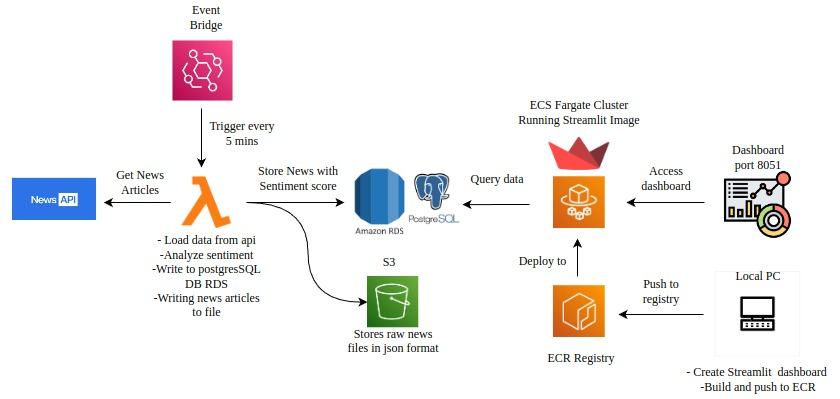

# 📰 News Sentiment Analysis Pipeline on AWS

A cloud-native data pipeline that automatically collects news articles, performs sentiment analysis, stores processed results in PostgreSQL, archives raw data in Amazon S3, and visualizes insights through a Streamlit dashboard running on AWS ECS Fargate.

---

## 📖 Overview

This project leverages AWS serverless and container services to create an automated news analytics platform.

The pipeline runs every 5 minutes using Amazon EventBridge and AWS Lambda. News articles are fetched from an external News API, analyzed for sentiment, and stored in Amazon RDS PostgreSQL. Raw API responses are archived in Amazon S3 for backup and future processing.

A Streamlit dashboard is containerized using Docker, stored in Amazon ECR, and deployed on Amazon ECS Fargate, allowing users to view sentiment trends and news insights in near real-time.

---

## 🏗️ Architecture



### Workflow

1. Amazon EventBridge triggers the Lambda function every 5 minutes.
2. AWS Lambda fetches news articles from the News API.
3. Sentiment analysis is performed on the articles.
4. Processed news data is stored in PostgreSQL (Amazon RDS).
5. Raw news responses are saved as JSON files in Amazon S3.
6. Streamlit dashboard queries data from PostgreSQL.
7. Docker image is pushed to Amazon ECR.
8. ECS Fargate deploys and runs the dashboard container.

---

## ☁️ AWS Services Used

| Service | Purpose |
|----------|---------|
| Amazon EventBridge | Scheduled triggering every 5 minutes |
| AWS Lambda | Data ingestion and sentiment processing |
| Amazon RDS PostgreSQL | Storage for processed news data |
| Amazon S3 | Raw news archive storage |
| Amazon ECR | Docker image repository |
| Amazon ECS Fargate | Container hosting for Streamlit |
| IAM | Secure service permissions |

---

## 🚀 Features

- Automated news collection
- Sentiment analysis of articles
- PostgreSQL data storage
- Raw JSON backup in S3
- Interactive Streamlit dashboard
- Docker containerization
- Serverless data processing
- Scalable AWS architecture

---

## 📂 Project Structure

```text
news-sentiment-analysis/
│
├── lambda/
│   ├── lambda_function.py
│   ├── sentiment_analysis.py
│   └── requirements.txt
│
├── dashboard/
│   ├── app.py
│   ├── Dockerfile
│   └── requirements.txt
│
├── data/
│   └── sample_news.json
│
├── Architecture.jpeg
│
└── README.md
```

---

## 🔄 Data Flow

```text
News API
    │
    ▼
AWS Lambda
    │
 ┌──┴─────────┐
 │            │
 ▼            ▼
Amazon RDS   Amazon S3
(PostgreSQL) (Raw JSON)
     │
     ▼
Streamlit Dashboard
     │
     ▼
ECS Fargate
```

---

## 🛠️ Tech Stack

- Python
- AWS Lambda
- Amazon EventBridge
- Amazon RDS PostgreSQL
- Amazon S3
- Amazon ECR
- Amazon ECS Fargate
- Docker
- Streamlit
- News API
- TextBlob / NLTK Sentiment Analysis

---

## ⚙️ Setup

### Clone Repository

```bash
git clone https://github.com/yourusername/news-sentiment-analysis.git

cd news-sentiment-analysis
```

### Install Dependencies

```bash
pip install -r requirements.txt
```

---

## 🗄️ Database Schema

```sql
CREATE TABLE news_articles (
    id SERIAL PRIMARY KEY,
    title TEXT,
    description TEXT,
    source VARCHAR(255),
    published_at TIMESTAMP,
    sentiment VARCHAR(50),
    sentiment_score FLOAT,
    created_at TIMESTAMP DEFAULT CURRENT_TIMESTAMP
);
```

---

## 🐳 Docker Build

Build the Streamlit application:

```bash
docker build -t news-dashboard .
```

Run locally:

```bash
docker run -p 8051:8051 news-dashboard
```

---

## 📦 Push Image to ECR

```bash
aws ecr get-login-password \
| docker login \
--username AWS \
--password-stdin ACCOUNT_ID.dkr.ecr.REGION.amazonaws.com

docker tag news-dashboard:latest \
ACCOUNT_ID.dkr.ecr.REGION.amazonaws.com/news-dashboard:latest

docker push \
ACCOUNT_ID.dkr.ecr.REGION.amazonaws.com/news-dashboard:latest
```

---

## 🚀 Deploy to ECS Fargate

1. Create ECS Cluster
2. Create Task Definition
3. Configure Service
4. Attach Security Groups
5. Deploy the container from ECR

The dashboard will be accessible through the ECS public endpoint.

---

## 📊 Dashboard Features

- News article listings
- Sentiment distribution charts
- Positive vs Negative article counts
- Historical sentiment trends
- Source-wise analysis
- Interactive filtering

---

## 🔒 Security Best Practices

- Store API keys in AWS Secrets Manager
- Use IAM least-privilege permissions
- Enable encryption for RDS and S3
- Restrict database access through Security Groups
- Use HTTPS with an Application Load Balancer

---

## 📈 Future Improvements

- Real-time streaming with Amazon Kinesis
- Advanced NLP models (BERT/FinBERT)
- Multi-source news aggregation
- Automated alerting on sentiment spikes
- CI/CD with GitHub Actions
- User authentication and role management

---

## 👨‍💻 Author

**Abhinav Shyju C**

Built using AWS serverless and container services to provide automated sentiment-driven insights from real-time news data.

---------------------